# Ansible Refactoring, Assignments & Imports

`Code refactoring` is the process of restructuring existing computer code—changing the factoring—without changing its external behavior. The purpose of it is to improve the design, structure, and/or implementation of the software (its non-functional attributes), while preserving its functionality.

## Requirements
- Have a PC or Laptop
- Have an AWS account
- Have a GitHub account
- An EC2 instance with Ubuntu as the AMI to serve as Jenkins-Ansible server
- Two EC2 instances to with RedHat as the AMI to serve as webservers
Two EC2 instances with RedHat as the AMI to serve as UAT webservers
- One EC2 instance with RedHat as the AMI to serve as database server
- One EC2 instance with Ubuntu as the AMI to serve as loadbalancer server

# Step 1 - Jenkins job enhancement

Before we begin, let us make some changes to our earlier Jenkins job - now every new change in the codes creates a separate directory which is not very convenient when we want to run some commands from one place. Besides, it consumes space on Jenkins server with each subsequent change. Let us enhance it by introducing a new Jenkins project/job - we will require Copy Artifact plugin.

1. On your `Jenkins-Ansible` server, create a new directory and name it `ansible-config-artifact`. All artifacts will be stored on this directory after each build. Run the below command:

```python
sudo mkdir /home/ubuntu/ansible-config-artifact
```
2. Grant permissions to the directory so Jenkins could save files there. Type in this command `chmod -R 0777 /home/ubuntu/ansible-config-artifact`

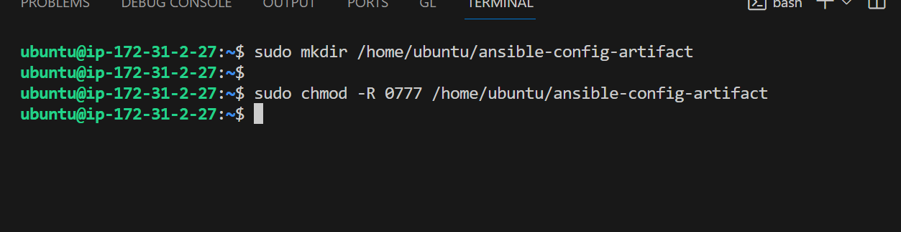

3. Open your Jenkins web console on your browser; click on Manage Jenkins->Manage Plugins->on Available plugings tab, search for `Copy Artifact` and install this plugin without restarting Jenkins.

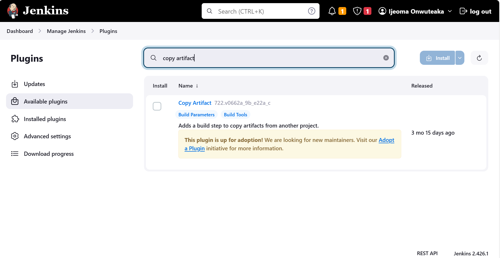

4. Create a new Freestyle project and call it `save_artifacts`.

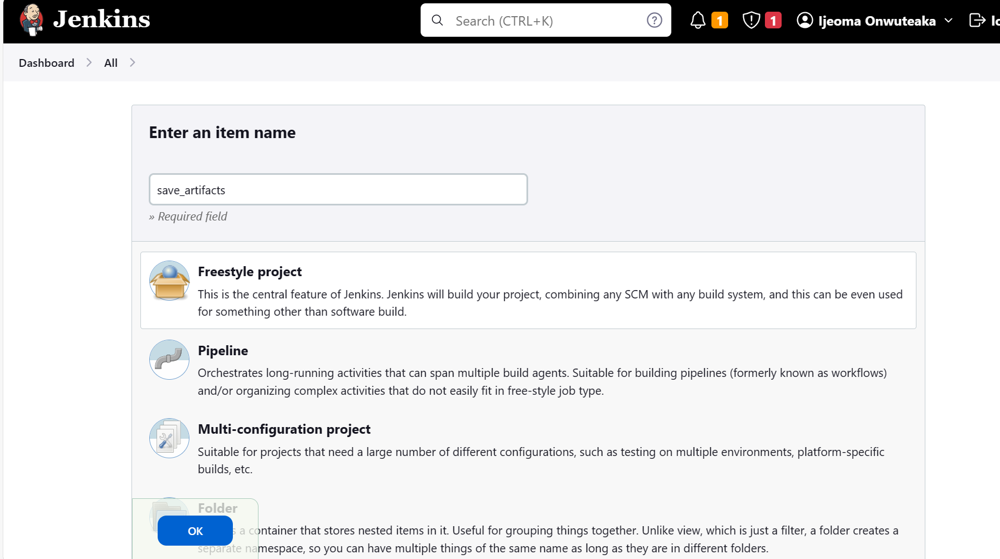

5. You need to configure the project so that it will  be triggered by completion of your existing ansible project. To do so check the **Discard old builds** box and set **Max # of builds to keep** to 2. You can configure number of builds to keep in order to save space on your server, for instance, you can decide to keep the last 2 or 4 build results.

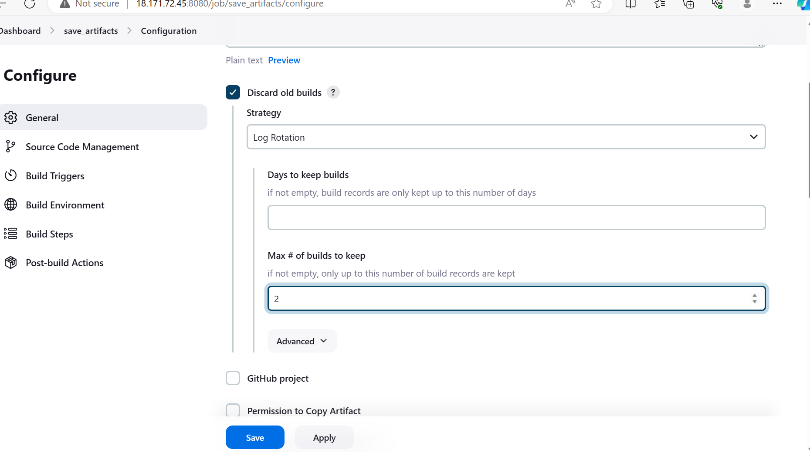

Under **Build Triggers** select **Build after other projects are built** and set **Projects to watch** to a`nsible`.

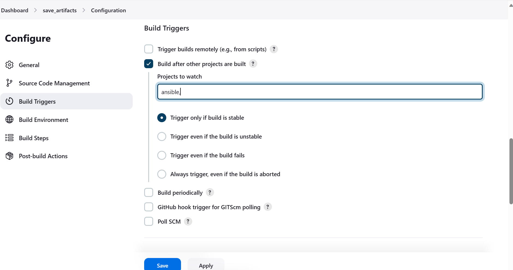

6. The main idea of `save_artifacts` project is to save artifacts into `/home/ubuntu/ansible-config-artifact` directory. To achieve this, we will create a Build step and choose "**Copy artifacts from other project**", specify "`ansible`" as a source project and `/home/ubuntu/ansible-config-artifact` as a target directory. In the "**Artifacts to copy**" box enter ** (** copies all the file).

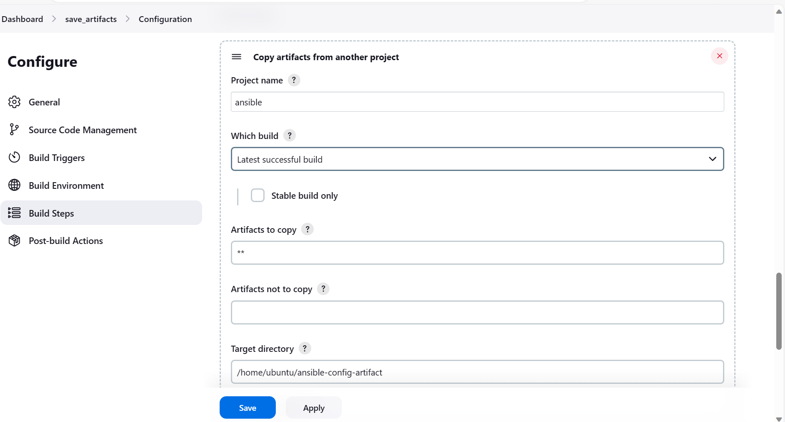

7. Test your set up by making some change in README.MD file inside your `ansible-config-mgt` repository (right inside main branch). If both Jenkins jobs have completed one after another - you shall see your files inside `/home/ubuntu/ansible-config-artifact` directory and it will be updated with every commit to your main branch.

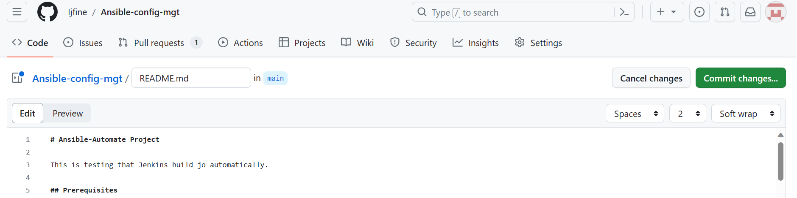

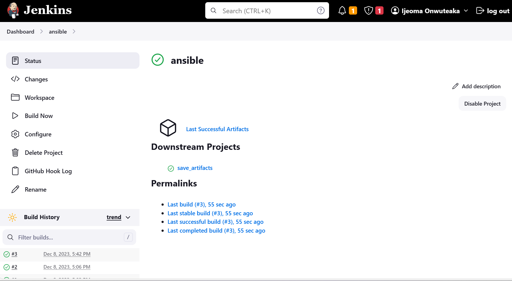

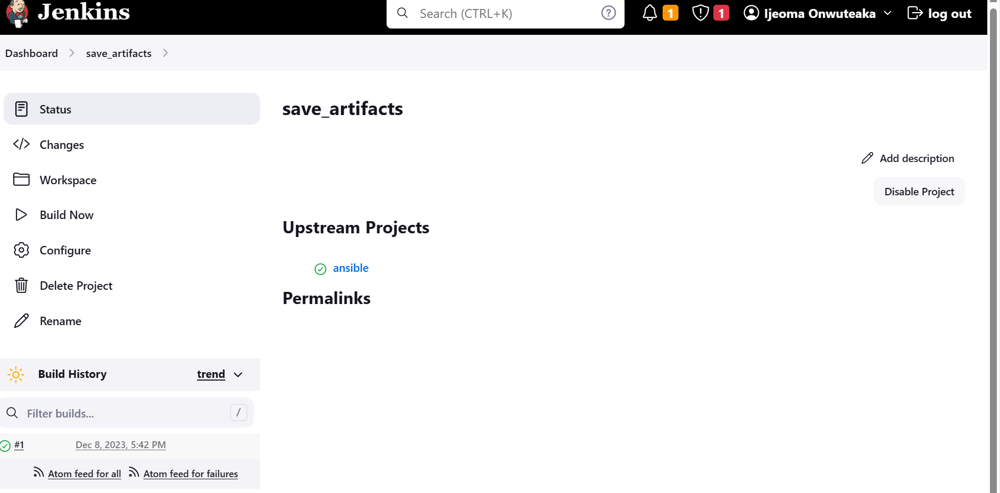

To check the file is saved in the directory run:

```python
sudo ls /home/ubuntu/ansible-config-artifact
```

# Step 2 - Refactor Ansible code by importing other playbooks 

Before starting to refactor the codes, ensure that you have pulled down the latest code from main branch, and create a new branch, name it refactor. Run this command `git checkout -b refactor`

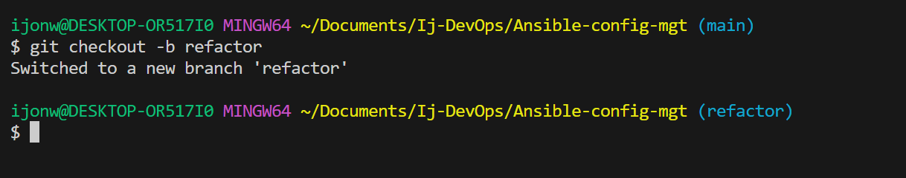

1. Within playbooks folder, create a new file and name it `site.yml` - This file will now be considered as an entry point into the entire infrastructure configuration. Other playbooks will be included here as a reference. In other words, `site.yml` will become a parent to all other playbooks that will be developed. Including `common.yml` that you created previously. Run: `touch playbooks/site.yml`.

2. Create a new folder in root of the repository and name it `static-assignments`. This folder is where all other children playbooks will be stored. This is merely for easy organization of your work. It is not an Ansible specific concept, therefore you can choose how you want to organize your work. To do it, run this command `mkdir static-assignments`.

3. Move your existing common.yml file into the newly created `static-assignments` folder. Type this command: `mv playbooks/common.yml static-assignments`

4. Inside the `site.yml` file, import `common.yml` playbook. Use any text editor to open `site.yml` and paste the below code inside it.

```python
---
- hosts: all
- import_playbook: ../static-assignments/common.yml
```

The above code uses built in `import_playbook` Ansible module.

Your folder structure should be like below:

```python
├── static-assignments
│   └── common.yml
├── inventory
    └── dev
    └── stage
    └── uat
    └── prod
└── playbooks
    └── site.yml
```

5. Run `ansible-playbook` command against the dev environment 

Since we need to apply some tasks to your `dev` servers and `wireshark` is already installed, we can go ahead and create another playbook under `static-assignments` and name it `common-del.yml` using this command: `touch static-assignments/common-del.yml`. In this playbook, we will configure deletion of `wireshark` utility. Use a text editor to open the common-del.yml file and paste the below command:

```python
---
- name: update web, nfs and db servers
  hosts: webservers, nfs, db
  remote_user: ec2-user
  become: yes
  become_user: root
  tasks:
  - name: delete wireshark
    yum:
      name: wireshark
      state: removed

- name: update LB server
  hosts: lb
  remote_user: ubuntu
  become: yes
  become_user: root
  tasks:
  - name: delete wireshark
    apt:
      name: wireshark-qt
      state: absent
      autoremove: yes
      purge: yes
      autoclean: yes
```

Update the `site.yml` with - `import_playbook: ../static-assignments/common-del.yml` instead of `common.yml` and run it against dev servers using the below command:

```python
cd /home/ubuntu/ansible-config-mgt/

ansible-playbook -i inventory/dev.yml playbooks/site.yml
```
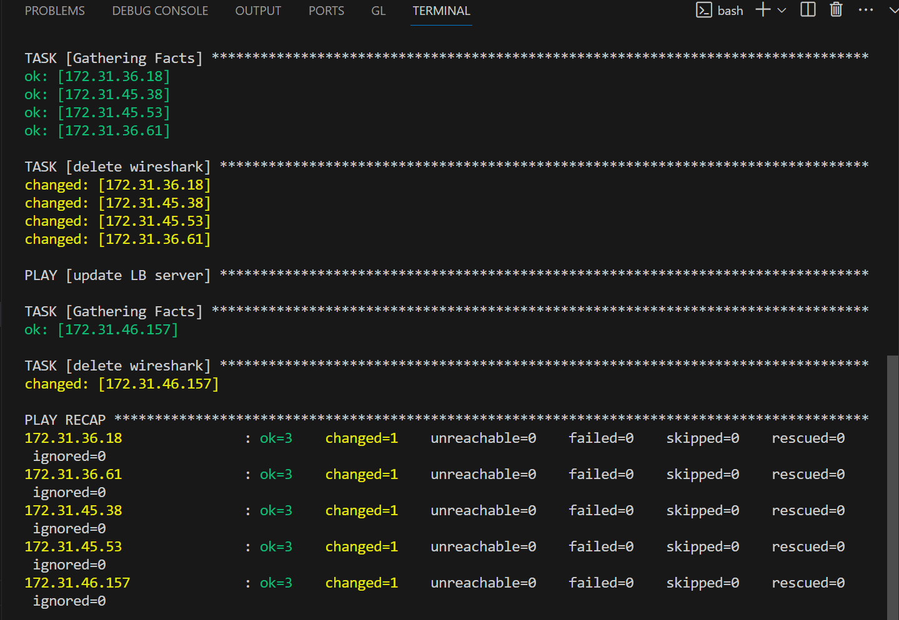

Check the webservers, database and loadbalancer servers to make sure `wireshark` is deleted using `wireshark --version`.

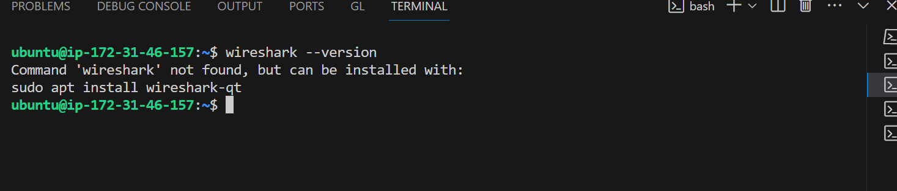

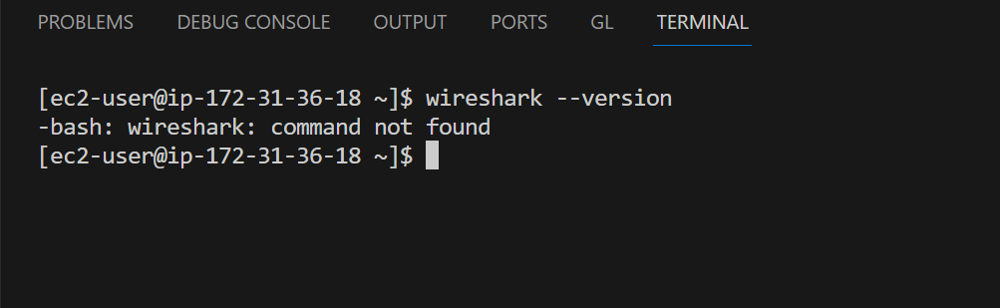

## Step 3 - Configure uat webservers with a role webserver

We have our nice and clean dev environment, so let us put it aside and configure 2 new Web Servers as `uat`. We could write tasks to configure Web Servers in the same playbook, but it would be too messy, instead, we will use a dedicated role to make our configuration reusable.

1. Launch 2 fresh EC2 instances using RHEL 8 image, we will use them as our `uat` servers, so give them names accordingly - `Web1-UAT` and `Web2-UAT`.

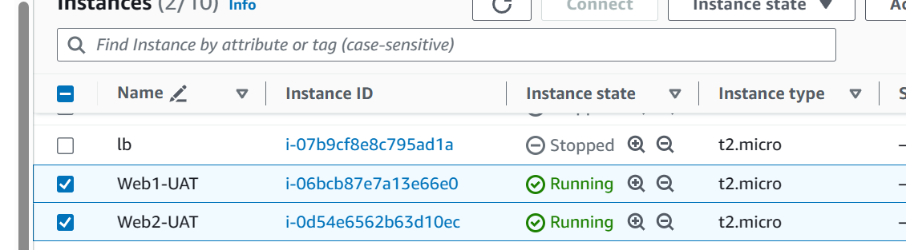

2. To create a role, you must create a directory called `roles/`. We will create it locally in our existing `ansible-config-mgt/` directory. Use this command:

```python
mkdir roles
cd roles
```
Inside the `roles` folder, create the following folder/files:

```python
└── webserver
    ├── README.md
    ├── defaults
    │   └── main.yml
    ├── handlers
    │   └── main.yml
    ├── meta
    │   └── main.yml
    ├── tasks
    │   └── main.yml
    └── templates
```
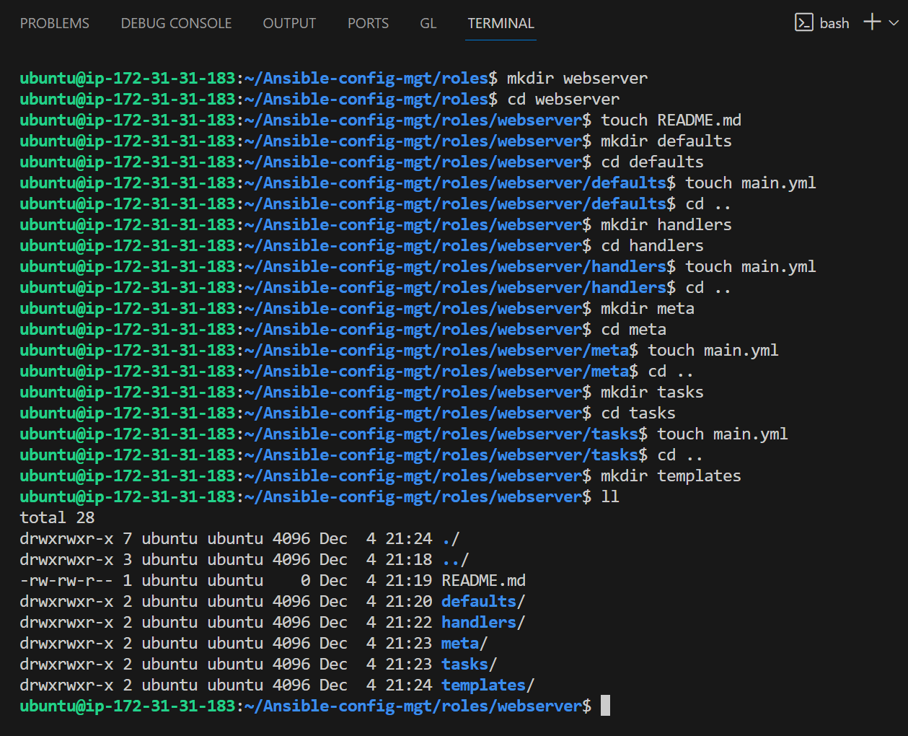

3. Update the inventory `ansible-config-mgt/inventory/uat.yml` file with IP addresses of your 2 UAT Web servers.

```python
[uat-webservers]
<Web1-UAT-Server-Private-IP-Address> ansible_ssh_user='ec2-user'
<Web2-UAT-Server-Private-IP-Address> ansible_ssh_user='ec2-user'
```
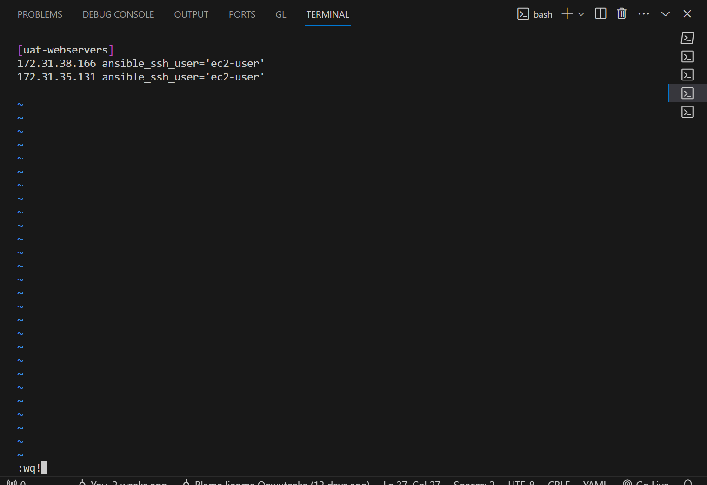

4. In /etc/ansible/ansible.cfg file, we will uncomment roles_path string and provide a full path to our roles directory roles_path = /home/ubuntu/ansible-config-artifact/roles so Ansible could know where to find configured roles.

This will be done with a text editor. Run this command: `sudo vi /etc/ansible/ansible.cfg`

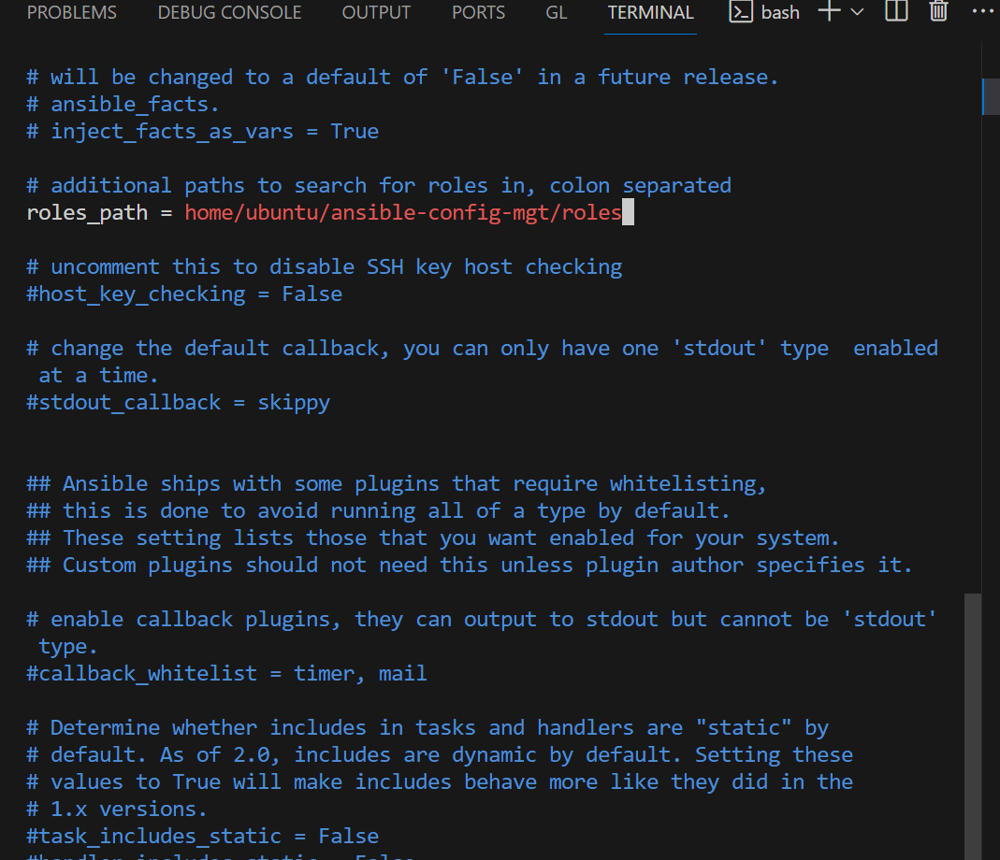

5. It is time to start adding some logic to the webserver role. Go into t`asks` directory, and within the `main.yml` file, start writing configuration tasks to do the following:

Install and configure Apache (`httpd` service)

Clone Tooling website from GitHub `https://github.com/<your-name>/tooling.git.`

Ensure the tooling website code is deployed to `/var/www/html` on each of 2 UAT Web servers.

Make sure `httpd` service is started

All these will be executed with the below code:

```python
---
- name: install apache
  become: true
  ansible.builtin.yum:
    name: "httpd"
    state: present

- name: install git
  become: true
  ansible.builtin.yum:
    name: "git"
    state: present

- name: clone a repo
  become: true
  ansible.builtin.git:
    repo: https://github.com/<your-name>/tooling.git
    dest: /var/www/html
    force: yes

- name: copy html content to one level up
  become: true
  command: cp -r /var/www/html/html/ /var/www/

- name: Start service httpd, if not started
  become: true
  ansible.builtin.service:
    name: httpd
    state: started

- name: recursively remove /var/www/html/html/ directory
  become: true
  ansible.builtin.file:
    path: /var/www/html/html
    state: absent
```
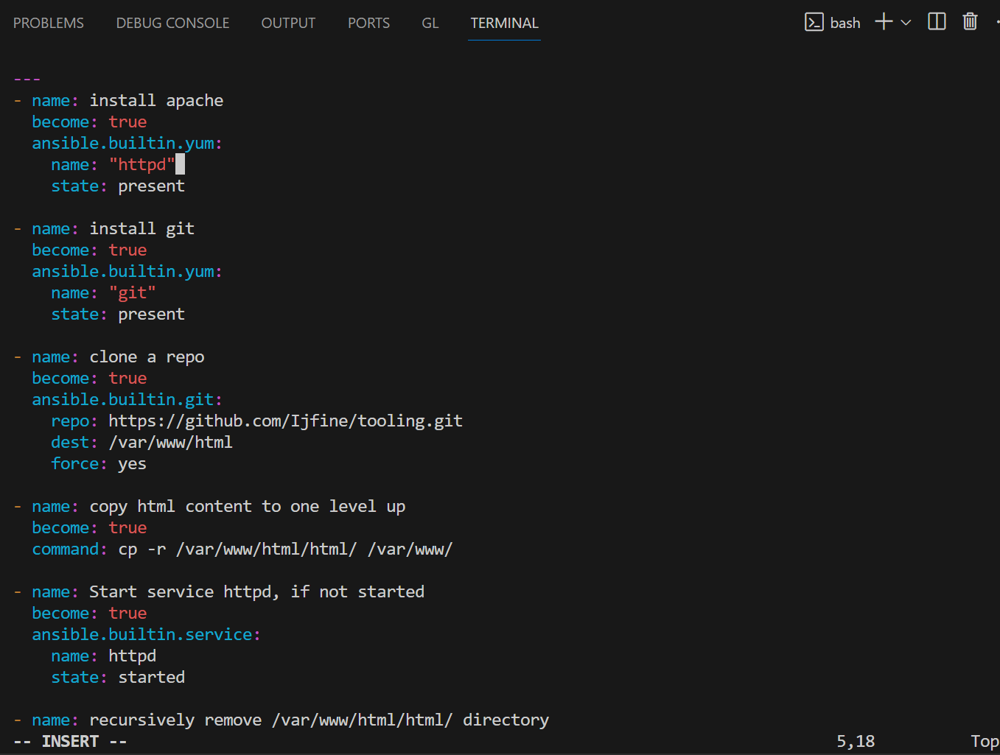

## Step 4 - Reference webserver role

Within the `static-assignments` folder, create a new assignment file for uat-webservers `uat-webservers.yml`. This is where you will reference the role created earlier. Inside `uat-webservers.yml`, paste the below code:

````python
---
- hosts: uat-webservers
  roles:
     - webserver
````

Remember that the entry point to our ansible configuration is the `site.yml` file. Therefore, you need to refer your `uat-webservers.yml` role inside `site.yml` just like we did with with common-del.yml earlier on. Inside your `site.yml` paste the below code:

```python
---
- hosts: all
- import_playbook: ../static-assignments/common.yml

- hosts: uat-webservers
- import_playbook: ../static-assignments/uat-webservers.yml
```
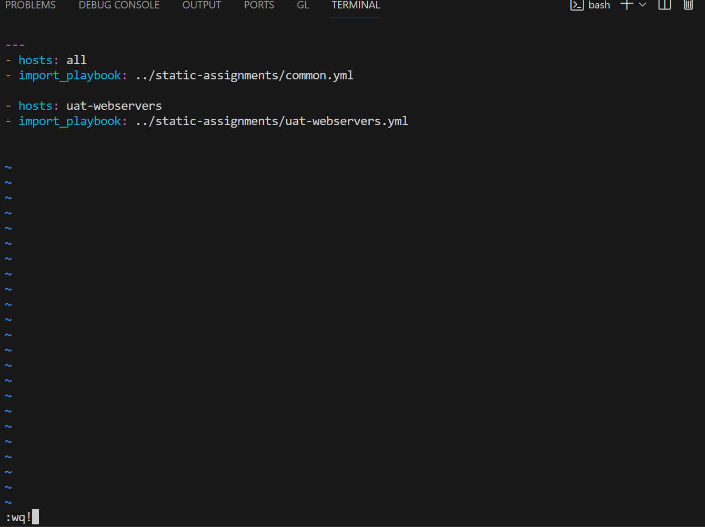

## Step 5 - Commit & Test

Commit your changes, create a Pull Request and merge them to main branch, make sure webhook triggered two consequent Jenkins jobs(`ansible` and `save_artifacts`), they ran successfully and copied all the files to your `Jenkins-Ansible` server into `/home/ubuntu/ansible-config-artifact/` directory.

Now run the playbook against your `uat` inventory with the following commands and see what happens.

```python
cd /home/ubuntu/ansible-config-mgt

ansible-playbook -i /inventory/uat.yml playbooks/site.yml
```
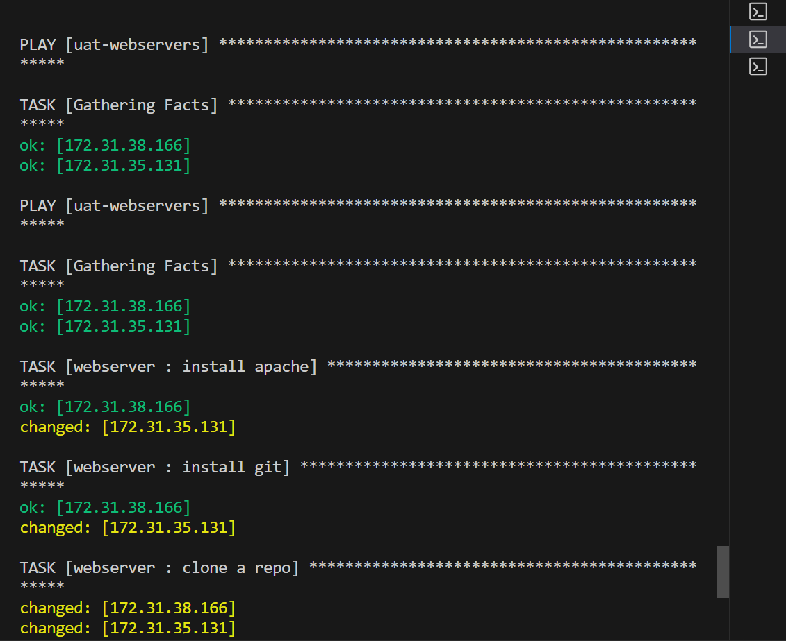
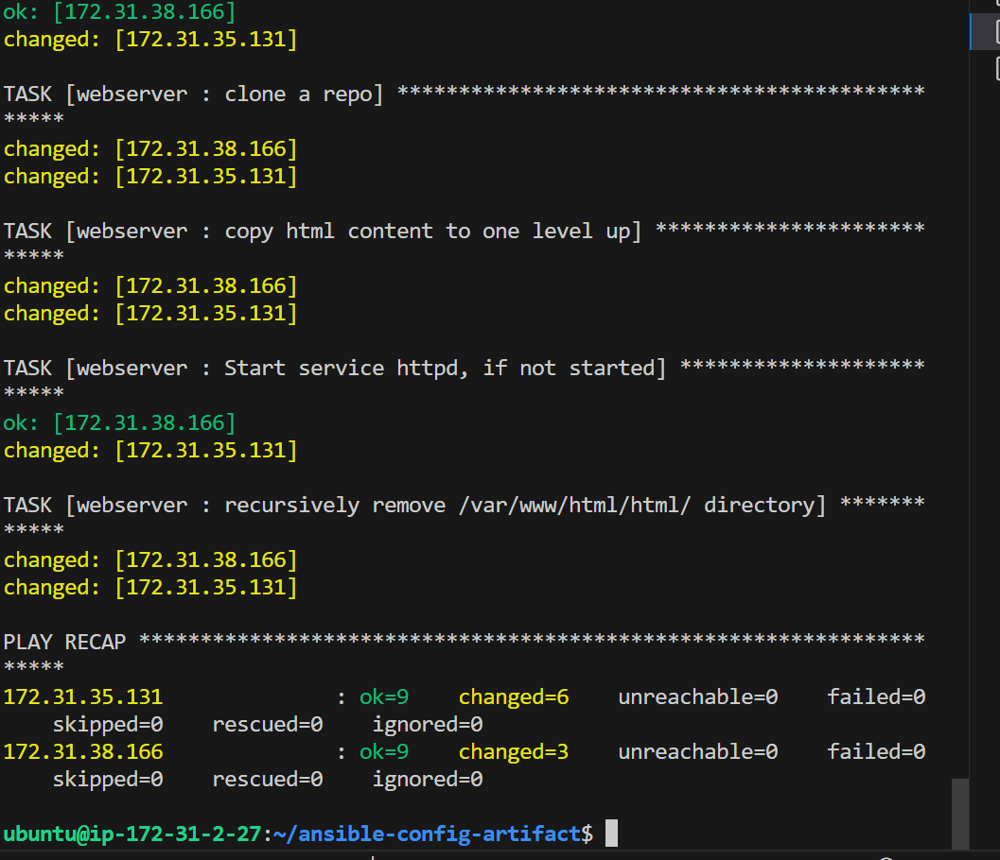

Now, you should be able to see both of your UAT Web servers configured and you can try to reach them from our browser using:

`http://<Web1-UAT-Server-Public-IP-or-Public-DNS-Name>/index.php
`
or

`http://<Web2-UAT-Server-Public-IP-or-Public-DNS-Name>/index.php`

Do not forget to open port 80 on your uat webservers security group as default Apache uses port 80.


Your Ansible architecture now looks like below:

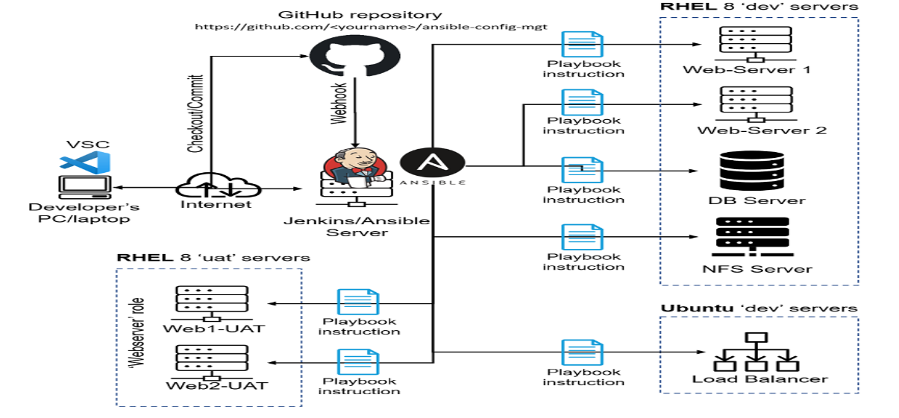

